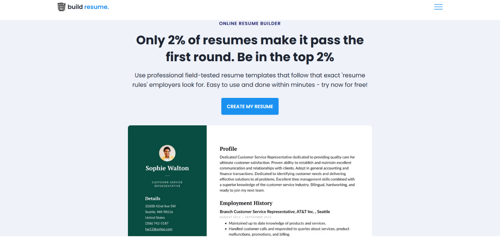

# RESUME BUILDER



## About
Welcome to the **Resume Builder**, my very first individual web development project, developed during my **third semester**! This project demonstrates my foundational knowledge in core front-end technologies and serves as a practical application of the skills I've acquired.
This application is built using **HTML, CSS, JavaScript,** and **Bootstrap,** providing a responsive and user-friendly experience. It has been a significant learning journey, and I'm eager to continue improving and expanding my web development expertise.
## Features
1. **Home page**:  The welcoming entry point of the application. It clearly states the project's purpose, includes a call-to-action button to proceed to the resume creation, and showcases an illustrative image of the final resume output. It also highlights compelling reasons to utilize the builder.

2. **Resume Creation Page**: This is where users input their details across various sections: About, Education, Skills, Experience, and Projects. Each section is structured with user-friendly forms, leveraging Bootstrap for a responsive design.

3. **validations**: I use **JavaScript** to validate the input fields. It checks if the fields are empty or not also uses **Regular Expressions** to match patterns.

4. **Preview section**: This section is used to display the resume in a **Dynamic way** means user can see the resume in real time. I use **JavaScript** to update the resume whenever user input something in the form.

5. **Print cv**: This feature is used to print the resume. I use ``windows.print()`` function to print the resume. later on i will use **pdf generation** library to generate the resume in pdf format.

6. **Repeater Functionality**: It uses a jQuery script that initializes a repeater functionality for a form element with the class ``.repeater``. It ensures that the code inside the function runs only after the DOM is fully loaded. It prevents any manipulation of elements that may not yet be available. This functionality is not implemented by me i refer it from a website.

7. **Formating**: I use **CSS** to make the resume look good and user friendly this improves appearance and formating of overall website. If you want to change entire theam of website then you can change the **CSS file root variables**. It also utilizes **Google Fonts** to make the text look more beautiful and presentable.


## Installations
Clone the repo:
 ```sh
 git clone https://github.com/jainamb12/cake-shop.git
 ```

## Contributing
Contributions are welcome! Follow these steps:
1. Fork the project.
2. Create a new branch (`git checkout -b feature-branch`).
3. Commit your changes (`git commit -m 'Add feature'`).
4. Push to the branch (`git push origin feature-branch`).
5. Open a pull request.
